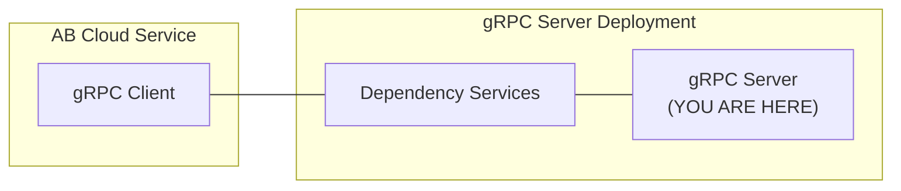

# session-dsm-grpc-plugin-server-go



`AccelByte Gaming Services` capabilities can be extended using custom functions implemented in a `gRPC server`.
If configured, custom functions in the `gRPC server` will be called by `AccelByte Gaming Services` instead of the default function.

The `gRPC server` and the `gRPC client` can actually communicate directly. 
However, additional services are necessary to provide **security**, **reliability**, **scalability**, and **observability**. 
We call these services as `dependency services`. 
The [grpc-plugin-dependencies](https://github.com/AccelByte/grpc-plugin-dependencies) repository is provided 
as an example of what these `dependency services` may look like. 
It contains a docker compose which consists of these `dependency services`.

> :warning: **grpc-plugin-dependencies is provided as example for local development purpose only:** The dependency services in the actual gRPC server deployment may not be exactly the same.

## Overview

This repository contains `sample matchmaking function gRPC server app` written in `Go`, It provides simple custom
matchmaking function implementation for matchmaking service in `AccelByte Gaming Services`. 
It will simply match 2 players coming into the function.

This sample app also shows how this `gRPC server` can be instrumented for better observability.
It is configured by default to send metrics, traces, and logs to the observability `dependency services` 
in [grpc-plugin-dependencies](https://github.com/AccelByte/grpc-plugin-dependencies).

## Prerequisites

1. Windows 10 WSL2 or Linux Ubuntu 20.04 with the following tools installed.

   a. bash

   b. make

   c. docker v23.x

   d. docker-compose v2.x

   e. docker loki driver
    
      ```
      docker plugin install grafana/loki-docker-driver:latest --alias loki --grant-all-permissions
      ```

   f. go 1.18

   g. git

   h. [ngrok](https://ngrok.com/)

   i. [postman](https://www.postman.com/)

2. A local copy of [grpc-plugin-dependencies](https://github.com/AccelByte/grpc-plugin-dependencies) repository.

   ```
   git clone git@github.com/AccelByte/session-dsm-grpc-plugin-go.git
   ```

3. Access to `AccelByte Gaming Services` environment.

   a. Base URL: https://prod.gamingservices.accelbyte.io

   b. [Create a Game Namespace](https://docs.accelbyte.io/esg/uam/namespaces.html#tutorials) if you don't have one yet. Keep the `Namespace ID`.

   c. [Create an OAuth Client](https://docs.accelbyte.io/guides/access/iam-client.html) with confidential client type with the following permission. Keep the `Client ID` and `Client Secret`.

      - NAMESPACE:{namespace}:MMV2GRPCSERVICE [READ]

## Setup

To be able to run this sample app, you will need to follow these setup steps.

1. Create a docker compose `.env` file by copying the content of [.env.template](.env.template) file.

   > :warning: **The host OS environment variables have higher precedence compared to `.env` file variables**: If the variables in `.env` file do not seem to take effect properly, check if there are host OS environment variables with the same name. 
   See documentation about [docker compose environment variables precedence](https://docs.docker.com/compose/environment-variables/envvars-precedence/) for more details.

2. Fill in the required environment variables in `.env` file as shown below.

   ```
   AB_BASE_URL=https://prod.gamingservices.accelbyte.io      # Base URL of AccelByte Gaming Services prod environment
   AB_CLIENT_ID='xxxxxxxxxx'         # Client ID from the Prerequisites section
   AB_CLIENT_SECRET='xxxxxxxxxx'     # Client Secret from the Prerequisites section
   PLUGIN_GRPC_SERVER_AUTH_ENABLED=false      # Enable or disable access token and permission verification
   AWS_ACCESS_KEY_ID='xxxxxxx' # aws access key if using gamelift
   AWS_SECRET_ACCESS_KEY='xxxxxx' #aws secret key if using gamelift
   GAMELIFT_REGION='us-west-2' #aws secret key if using gamelift region
   // GCP Config
	GCPProjectID='Project ID in GCP VM'
	GCPRegion='GCP Region'
	GCPNetwork='GCP Network for allow trafic and port'
	GCPMachineType='GCP Machine Type example e2-micro'
	GCPRepository='GCP Repository URL'
	GCPRetry='GCP Retry for get instance'
   GCP_WAIT_GET_IP='GCP Wait Get IP'
   ```

   > :warning: **Keep PLUGIN_GRPC_SERVER_AUTH_ENABLED=false for now**: It is currently not
   supported by `AccelByte Gaming Services`, but it will be enabled later on to improve security. If it is
   enabled, the gRPC server will reject any calls from gRPC clients without proper authorization
   metadata.

3. Access to AccelByte Gaming Services environment.
a. Base URL: https://prod.gamingservices.accelbyte.io/admin

## Building

To build this sample app, use the following command.

```
make build
```

## Running

To (build and) run this sample app in a container, use the following command.

```
docker-compose -f docker-compose-gamelift.yaml up // this is for gamelift server
docker-compose -f docker-compose-gcpvm.yaml up // this is for gcp server
```

## Testing

### Functional Test in Local Development Environment

The custom functions in this sample app can be tested locally using `postman`.

1. Run the `dependency services` by following the `README.md` in the [grpc-plugin-dependencies](https://github.com/AccelByte/grpc-plugin-dependencies) repository.
   > :warning: **Make sure to start dependency services with mTLS disabled for now**: It is currently not supported by `AccelByte Gaming Services`, but it will be enabled later on to improve security. If it is enabled, the gRPC client calls without mTLS will be rejected.

2. Run this `gRPC server` sample app by using command below.
   ```shell
   docker-compose up --build
   ```

3. Open `postman`, create a new `gRPC request` (tutorial [here](https://blog.postman.com/postman-now-supports-grpc/)), and enter `localhost:10000` as server URL. 

   > :exclamation: We are essentially accessing the `gRPC server` through an `Envoy` proxy in `dependency services`.

4. In `postman`, continue by selecting `CreateGameSession` grpc call method and click `Invoke` button, this will start stream connection to grpc server sample app.
5. In `postman`, continue sending parameters first to specify number of players in a match by copying sample `json` below and click `Send`.

   ```json
   {
    "client_version": "test",
    "deployment": "test-deployment",
    "game_mode": "test-game",
    "maximum_player": "10",
    "namespace": "testing",
    "requested_region": [
        "us-west-1",
        "us-west-2"
    ],
    "session_data": "testing",
    "session_id": "uuidv4"
   }
   ```