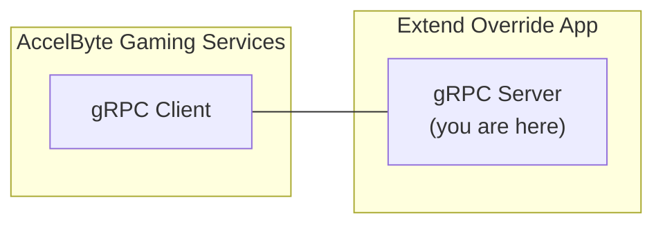

# session-dsm-grpc-plugin-server-go



`AccelByte Gaming Services` (AGS) features can be customized with 
`Extend Override` apps. An `Extend Override` app is a `gRPC server` which 
contains one or more custom functions which can be called by AGS 
instead of the default functions.

## Overview

This repository serves as a template project for an `Extend Override` 
app for `session dsm grpc plugin server` written in `Go`. You can clone this repository
and start implementing custom functions which can then be called by AGS.

By using this repository as a template project, you will get the recommended 
authentication and authorization implemented out-of-the-box. You will also get 
some instrumentation for observability so that metrics, traces, and 
logs will be available when the app is deployed.

As an example to get you started, this template project contains sample 
custom functions for session dsm grpc plugin payloads.

## Prerequisites

1. Windows 11 WSL2 or Linux Ubuntu 22.04 or macOS 14+ with the following tools installed.

   a. Bash

      ```
      bash --version

      GNU bash, version 5.1.16(1)-release (x86_64-pc-linux-gnu)
      ...
      ```

   b. Make

      - To install from Ubuntu repository, run: `sudo apt update && sudo apt install make` 

      ```
      make --version

      GNU Make 4.3
      ...
      ```

   c. Docker (Docker Engine v23.0+)

      - To install from Ubuntu repository, run: `sudo apt update && sudo apt install docker.io docker-buildx docker-compose-v2`
      - Add your user to `docker` group: `sudo usermod -aG docker $USER`
      - Log out and log back in so that the changes take effect

      ```
      docker version

      ...
      Server: Docker Desktop
       Engine:
        Version:          24.0.5
      ...
      ```

   d. Go v1.19

      - Follow [Go installation](https://go.dev/doc/install) instruction to install Go

      ```
      go version

      go version go1.19.0 linux/amd64
      ```

   e. Curl

      - To install from Ubuntu repository, run: `sudo apt update && sudo apt install curl`

      ```
      curl --version

      curl 7.81.0 (x86_64-pc-linux-gnu)
      ...
      ```

   f. Jq

      - To install from Ubuntu repository, run: `sudo apt update && sudo apt install jq`

      ```
      jq --version

      jq-1.6
      ...
      ```

   g. [Postman](https://www.postman.com/)

      - Use binary available [here](https://www.postman.com/downloads/)

   h. [ngrok](https://ngrok.com/)

      - Follow installation instruction for Linux [here](https://ngrok.com/download)

   > :exclamation: In macOS, you may use [Homebrew](https://brew.sh/) to easily install some of the tools above.

2. Access to AGS environment.

   a. Base URL
   
      - For `Starter` tier e.g.  https://prod.gamingservices.accelbyte.io
      
   b. [Create a Game Namespace](https://docs.accelbyte.io/gaming-services/tutorials/how-to/create-a-game-namespace/) if you don't have one yet. Keep the `Namespace ID`.

   c. [Create an OAuth Client](https://docs.accelbyte.io/gaming-services/services/access/authorization/manage-access-control-for-applications/#create-an-iam-client) with confidential client type. Keep the `Client ID` and `Client Secret`.

## Setup

To be able to run the sample custom functions, you will need to follow these 
setup steps.

1. Create a docker compose `.env` file by copying the content of 
   [.env.template](.env.template) file.

   > :warning: **The host OS environment variables have higher precedence compared to `.env` file variables**: If the variables in `.env` file do not seem to take 
   effect properly, check if there are host OS environment variables with the 
   same name. See documentation about 
   [docker compose environment variables precedence](https://docs.docker.com/compose/environment-variables/envvars-precedence/) 
   for more details.

2. Fill in the required environment variables in `.env` file as shown below.

   ```
   AB_BASE_URL=https://prod.gamingservices.accelbyte.io      # Base URL of AccelByte Gaming Services prod environment
   AB_CLIENT_ID='xxxxxxxxxx'         # Client ID from the Prerequisites section
   AB_CLIENT_SECRET='xxxxxxxxxx'     # Client Secret from the Prerequisites section
   PLUGIN_GRPC_SERVER_AUTH_ENABLED=false      # Enable or disable access token and permission verification
   AWS_ACCESS_KEY_ID='xxxxxxx' # aws access key if using gamelift
   AWS_SECRET_ACCESS_KEY='xxxxxx' #aws secret key if using gamelift
   GAMELIFT_REGION='us-west-2' #aws secret key if using gamelift region
   // GCP Config
	GCPProjectID='Project ID in GCP VM'
	GCPRegion='GCP Region'
	GCPNetwork='GCP Network for allow trafic and port'
	GCPMachineType='GCP Machine Type example e2-micro'
	GCPRepository='GCP Repository URL'
	GCPRetry='GCP Retry for get instance'
   GCP_WAIT_GET_IP='GCP Wait Get IP'
   ```
   the image only can run 1 server gcpvm or gamelift

## Build

```
docker build -f Dockerfilegamelift . // this is use for gamelift
docker build -f Dockerfilegamelift . // this is use for gcpvm
```

## Running

To (build and) run this sample app in a container, use the following command.

```
docker-compose -f docker-compose-gamelift.yaml up --build // this is for gamelift server
docker-compose -f docker-compose-gcpvm.yaml up --build // this is for gcp server
```

## Testing

### Test in Local Development Environment

The custom functions in this sample app can be tested locally using [postman](https://www.postman.com/).

1. Run this `gRPC server` sample app by using the command below.

   ```shell
   docker-compose -f docker-compose-gamelift.yaml up --build // this is for gamelift server
   docker-compose -f docker-compose-gcpvm.yaml up --build // this is for gcp server
   ```

2. Open `postman`, create a new `gRPC request`, and enter `localhost:6565` as server URL (tutorial [here](https://blog.postman.com/postman-now-supports-grpc/)). 

3. In `postman`, continue by selecting `CreateGameSession` grpc call method and click `Invoke` button, this will start stream connection to grpc server sample app.
4. In `postman`, continue sending parameters first to specify number of players in a match by copying sample `json` below and click `Send`.

   ```json
   {
    "client_version": "test",
    "deployment": "test-deployment",
    "game_mode": "test-game",
    "maximum_player": "10",
    "namespace": "testing",
    "requested_region": [
        "us-west-1",
        "us-west-2"
    ],
    "session_data": "testing",
    "session_id": "uuidv4"
   }
   ```

### Test with AccelByte Gaming Services

For testing this sample app which is running locally with AGS,
the `gRPC server` needs to be exposed to the internet. To do this without requiring 
public IP, we can use something like [ngrok](https://ngrok.com/).

1. Run this `gRPC server` sample app by using command below.

   ```shell
   docker-compose -f docker-compose-gamelift.yaml up --build // this is for gamelift server
   docker-compose -f docker-compose-gcpvm.yaml up --build // this is for gcp server
   ```

2. Sign-in/sign-up to [ngrok](https://ngrok.com/) and get your auth token in `ngrok` dashboard.

3. In this sample app root directory, run the following helper command to expose `gRPC server` port in local development environment to the internet. Take a note of the `ngrok` forwarding URL e.g. `http://0.tcp.ap.ngrok.io:xxxxx`.

   ```
   make ngrok NGROK_AUTHTOKEN=xxxxxxxxxxx
   ```

> :warning: **Ngrok free plan has some limitations**: You may want to use paid plan if the traffic is high.

### Test Observability

To be able to see the how the observability works in this sample app locally, there are few things that need be setup before performing tests.

1. Clone and run [session-dsm-grpc-plugin-go](github.com/AccelByte/session-dsm-grpc-plugin-go) sample app. 

   ```
   git clone https://github.com/AccelByte/session-dsm-grpc-plugin-go.git
   cd grpc-plugin-dependencies
   docker-compose up
   ```

   > :exclamation: More information about [session-dsm-grpc-plugin-go](https://github.com/AccelByte/session-dsm-grpc-plugin-go) 

3. Perform testing. For example, by following [Test in Local Development Environment](#test-in-local-development-environment) or [Test with AccelByte Gaming Services](#test-with-accelbyte-gaming-services).

## Deploying

After done testing, you may want to deploy this app to `AccelByte Gaming Services`.

1. [Create a new Extend Override App on Admin Portal](https://docs.accelbyte.io/gaming-services/services/extend/override-ags-feature/getting-started-with-cloudsave-validator-customization/#create-the-extend-app). Keep the `Repository URI`.

2. Download and setup [extend-helper-cli](https://github.com/AccelByte/extend-helper-cli/) (only if it has not been done previously).

3. Perform docker login with `extend-helper-cli` using the following command.

   ```
   extend-helper-cli dockerlogin --namespace <my-game> --app <my-app> --login
   ```

   > :exclamation: For your convenience, the above `extend-helper-cli` command can also be 
   copied from `Repository Authentication Command` under the corresponding app detail page.

4. Build and push sample app docker image to AccelByte ECR using the following command.
   
   ```
   extend-helper-cli image-upload --work-dir <my-project-dir> --namespace <my-game> --app <my-app> --image-tag v0.0.1
   ```

   > :warning: Make sure to perform docker login (step 3) before executing the above command.

5. Open Admin Portal, go to **Extend** -> **Overridable Features**. And then select the extend app.

6. To deploy selected image tag, click **Image Version History** and select 
   desired image tag to be deployed.

7. Click **Deploy Image**, confirm the deployment and go back to App Detail by 
   clicking **Cancel**.

8. Wait until app status is running.

## Next Step

Proceed to modify this template project and implement your own custom functions.