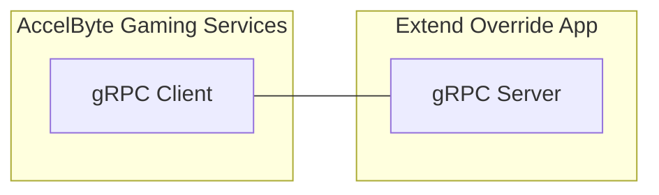

# session-dsm-grpc-plugin-server-go



`AccelByte Gaming Services` (AGS) features can be customized using 
`Extend Override` apps. An `Extend Override` app is basically a `gRPC server` which 
contains one or more custom functions which can be called by AGS instead of the 
default functions.

## Overview

This repository provides a project template to create an `Extend Override` 
app for `session dsm grpc plugin server` written in `Go`. It includes an example of how the
custom functions can be implemented. It also includes the essential 
`gRPC server` authentication and authorization to ensure security. Additionally, 
it comes with built-in instrumentation for observability, ensuring that metrics, 
traces, and logs are available upon deployment.

You can clone this repository to begin developing your own `Extend Override` 
app for `session dsm grpc plugin server`. Simply modify this project by implementing
your own logic for the custom functions.

## Prerequisites

1. Windows 11 WSL2 or Linux Ubuntu 22.04 or macOS 14+ with the following tools installed.

   a. Bash

      ```
      bash --version

      GNU bash, version 5.1.16(1)-release (x86_64-pc-linux-gnu)
      ...
      ```

   b. Make

      - To install from Ubuntu repository, run: `sudo apt update && sudo apt install make` 

      ```
      make --version

      GNU Make 4.3
      ...
      ```

   c. Docker (Docker Engine v23.0+)

      - To install from Ubuntu repository, run: `sudo apt update && sudo apt install docker.io docker-buildx docker-compose-v2`
      - Add your user to `docker` group: `sudo usermod -aG docker $USER`
      - Log out and log back in so that the changes take effect

      ```
      docker version

      ...
      Server: Docker Desktop
       Engine:
        Version:          24.0.5
      ...
      ```

   d. Go v1.22

      - Follow [Go installation](https://go.dev/doc/install) instruction to install Go

      ```
      go version

      go version go1.22.0 linux/amd64
      ```

   e. Curl

      - To install from Ubuntu repository, run: `sudo apt update && sudo apt install curl`

      ```
      curl --version

      curl 7.81.0 (x86_64-pc-linux-gnu)
      ...
      ```

   f. Jq

      - To install from Ubuntu repository, run: `sudo apt update && sudo apt install jq`

      ```
      jq --version

      jq-1.6
      ...
      ```

   g. [Postman](https://www.postman.com/)

      - Use binary available [here](https://www.postman.com/downloads/)

   h. [extend-helper-cli](https://github.com/AccelByte/extend-helper-cli)

      - Use the available binary from [extend-helper-cli](https://github.com/AccelByte/extend-helper-cli/releases).

   i. Local tunnel service that has TCP forwarding capability, such as:

      - [Ngrok](https://ngrok.com/)
         
         Need registration for free tier. Please refer to [ngrok documentation](https://ngrok.com/docs/getting-started/) for a quick start.

      - [Pinggy](https://pinggy.io/)

         Free to try without registration. Please refer to [pinggy documentation](https://pinggy.io/docs/) for a quick start.

   > :exclamation: In macOS, you may use [Homebrew](https://brew.sh/) to easily install some of the tools above.

   ```
   git clone https://github.com/AccelByte/session-dsm-grpc-plugin-go.git
   ```

   a. Base URL
   
      - Sample URL for AGS Shared Cloud customers: https://spaceshooter.prod.gamingservices.accelbyte.io
      
   b. [Create a Game Namespace](https://docs.accelbyte.io/gaming-services/services/access/reference/namespaces/manage-your-namespaces/) if you don't have one yet. Keep the `Namespace ID`.

   c. [Create an OAuth Client](https://docs.accelbyte.io/gaming-services/services/access/authorization/manage-access-control-for-applications/#create-an-iam-client) with confidential client type. Keep the `Client ID` and `Client Secret`.

## Setup

To be able to run this app, you will need to follow these setup steps.

1. Create a docker compose `.env` file by copying the content of
   [.env.template](.env.template) file.

   > :warning: **The host OS environment variables have higher precedence compared to `.env` file variables**: If the variables in `.env` file do not seem to take
   effect properly, check if there are host OS environment variables with the
   same name. See documentation about
   [docker compose environment variables precedence](https://docs.docker.com/compose/how-tos/environment-variables/envvars-precedence/)
   for more details.

2. Fill in the required environment variables in `.env` file as shown below.

   ```
   AB_BASE_URL=https://prod.gamingservices.accelbyte.io        # Base URL of AccelByte Gaming Services prod environment
   AB_CLIENT_ID='xxxxxxxxxx'                                   # Client ID from the Prerequisites section
   AB_CLIENT_SECRET='xxxxxxxxxx'                               # Client Secret from the Prerequisites section
   PLUGIN_GRPC_SERVER_AUTH_ENABLED=false                       # Enable or disable access token and permission verification
   DS_PROVIDER='DEMO'                                          # Select DS implementation, DEMO, GAMELIFT, or GCP
   
   // AWS Gamelift Config
   AWS_ACCESS_KEY_ID='xxxxxxx'                                 # AWS access key if using gamelift
   AWS_SECRET_ACCESS_KEY='xxxxxx'                              # AWS secret key if using gamelift
   AWS_REGION='us-west-2'                                      # AWS region for gamelift
   GAMELIFT_REGION='us-west-2'                                 # alias of AWS_REGION
      
   // GCP Config
   GCP_SERVICE_ACCOUNT_FILE='./account.json'                   # GCP service account file in json format
   GCP_PROJECT_ID=xxxxx-xxxx                                   # GCP Project ID
   GCP_NETWORK=public                                          # GCP Network type
   GCP_MACHINE_TYPE=e2-micro                                   # GCP intance type
   GCP_REPOSITORY=asia-southeast1-docker.pkg.dev/xxxx/gcpvm    # GCP Repository
   GCP_RETRY=3                                                 # GCP Retry to get instance
   GCP_WAIT_GET_IP=1                                           # GCP wait time to get the instance IP in seconds
   GCP_IMAGE_OPEN_PORT=8080                                    # Dedicated server open port
   ```

3. Access to AccelByte Gaming Services environment.

   a. Base URL: https://prod.gamingservices.accelbyte.io/admin

## Running

To (build and) run this app in a container, use the following command.

```
docker compose up --build
```

## Testing

### Test in Local Development Environment

The custom functions in this app can be tested locally using [postman](https://www.postman.com/).

1. Run this app by using the command below.

   ```shell
   docker compose up --build
   ```

2. Open `postman`, create a new `gRPC request`, and enter `localhost:6565` as server URL.

3. In `postman`, continue by selecting `CreateGameSession` grpc call method and click `Invoke` button, this will start stream connection to the gRPC server.

4. Still in `postman`, continue sending parameters first to specify number of players in a match by copying sample `json` below and click `Send`.

   ```json
   {
    "client_version": "test",
    "deployment": "test-deployment",
    "game_mode": "test-game",
    "maximum_player": "10",
    "namespace": "testing",
    "requested_region": [
        "us-west-1",
        "us-west-2"
    ],
    "session_data": "testing",
    "session_id": "uuidv4"
   }
   ```

### Test with AccelByte Gaming Services

To test the app, which runs locally with AGS, the `gRPC server` needs to be connected to the internet. To do this without requiring public IP, you can use local tunnel service.

1. Run this app by using command below.

   ```shell
   docker compose up --build
   ```

2. Expose `gRPC server` TCP port 6565 in local development environment to the internet. Simplest way to do this is by using local tunnel service provider.
   - Sign in to [ngrok](https://ngrok.com/) and get your `authtoken` from the ngrok dashboard and set it up in your local environment.
      And, to expose `gRPC server` use following command:
      ```bash
      ngrok tcp 6565
      ```

   - **Or** alternatively, you can use [pinggy](https://pinggy.io/) and use only `ssh` command line to setup simple tunnel.
      Then to expose `gRPC server` use following command:
      ```bash
      ssh -p 443 -o StrictHostKeyChecking=no -o ServerAliveInterval=30 -R0:127.0.0.1:6565 tcp@a.pinggy.io
      ```

   Please take note of the tunnel forwarding URL, e.g., `http://0.tcp.ap.ngrok.io:xxxxx` or `tcp://xxxxx-xxx-xxx-xxx-xxx.a.free.pinggy.link:xxxxx`.

   > :exclamation: You may also use other local tunnel service and different method to expose the gRPC server port (TCP) to the internet.

   > :warning: **If you are running [grpc-plugin-dependencies](https://github.com/AccelByte/grpc-plugin-dependencies) stack alongside this app as mentioned in [Test Observability](#test-observability)**: Run the above 
   command in `grpc-plugin-dependencies` directory instead of this app directory and change tunnel local port from 6565 to 10000.
   This way, the `gRPC server` will be called via `Envoy` service within `grpc-plugin-dependencies` stack instead of directly.

3. In admin portal go to -> Multiplayer > Matchmaking > Session Configuration. Click on the Add Session Template button. Select the Server configuration to be a DS - Custom. Then, select the Custom URL option and provide the tunnel forwarding URL from step 2.

4. create gamesession or do matchmaking

5. in Sessions and Parties - > check in session detail base on session id -> if ds status available check your server in GCPVM or gamelift

## Deploying

After done testing, you may want to deploy this app to `AccelByte Gaming Services`.

1. [Create a new Extend Override App on Admin Portal](https://docs.accelbyte.io/gaming-services/services/extend/override/getting-started-with-cloudsave-validator-customization/#create-the-extend-app). Keep the `Repository URI`.

2. Download and setup [extend-helper-cli](https://github.com/AccelByte/extend-helper-cli/) (only if it has not been done previously).

3. Perform docker login with `extend-helper-cli` using the following command.

   ```
   extend-helper-cli dockerlogin --namespace <my-game> --app <my-app> --login
   ```

   > :exclamation: For your convenience, the above `extend-helper-cli` command can also be 
   copied from `Repository Authentication Command` under the corresponding app detail page.

4. Build and push app docker image to AccelByte ECR using the following command.
   
   ```
   extend-helper-cli image-upload --work-dir <my-project-dir> --namespace <my-game> --app <my-app> --image-tag v0.0.1
   ```

   > :warning: Make sure to perform docker login (step 3) before executing the above command.

5. Open Admin Portal, go to **Extend** -> **Overridable Features**. And then select the extend app.

6. To deploy selected image tag, click **Image Version History** and select 
   desired image tag to be deployed.

7. Click **Deploy Image**, confirm the deployment and go back to App Detail by 
   clicking **Cancel**.

8. Wait until app status is running.

## Next Step

Proceed to create your own `Extend Override` app for `session dsm grpc plugin server` by modifying this project. See [here](https://docs.accelbyte.io/gaming-services/services/extend/override/session-dsm-function/) for more details.
