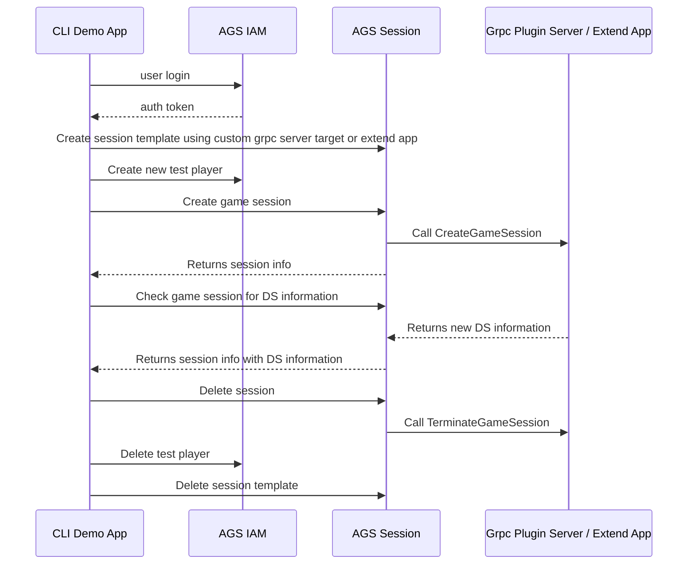

# Session Service's Custom DSM Plugin gRPC Demo App

A CLI demo app to prepare required data and execute Custom DSM Plugin gRPC for AGS's Session Service.
Following diagram will explain how this CLI demo app works.


## Prerequsites

- Docker
- make

## Usage

### Setup

The following environment variables are used by this CLI demo app.
```
export AB_BASE_URL='https://test.accelbyte.io'
export AB_CLIENT_ID='xxxxxxxxxx'
export AB_CLIENT_SECRET='xxxxxxxxxx'
export AB_NAMESPACE='namespace'

export GRPC_SERVER_URL='<gRPC server url accessible by internet>'
```
If these variables aren't provided, you'll need to supply the required values via command line arguments.

Also, you will need `Custom Session DSM Plugin gRPC` server already deployed and accessible. If you want to use your local development environment, you can use tunneling service like `ngrok` to tunnel your grpc server port so it can be accessed by AGS.
> Current AGS deployment does not support mTLS and authorization for custom grpc plugin. Make sure you disable mTls and authorization in your deployed Grpc server.


### Run

Run the demo test cli using makefile with provided .env file containing required variables

```bash
$ make run ENV_FILE_PATH=.env
```